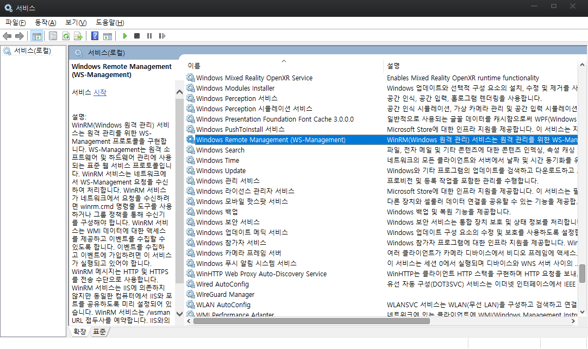

# Ansible 개요
- 네트워크 장비를 다루는게 주된 기능이여
- OpenSSH 를 사용하여 에이전트 없이 호스트를 관리함
- ansible이 설치되는 엔진은 반드시 유닉스 기반이어야함
- ssh 기본 인증 사용 passwd or key
- 필요한 경우 외부 인증 서버 연동 가능(kerberos, LDAP, MS active Directory 등)

## 용어
### 제어노드
salt, puppet, chef의 서버와는 결이 다르다. 
요녀석들은 별도의 데이터 베이스의 모든 작업을 저장하기 때문에 서버가 죽으면 문제가 발생하는데 
엔서블은 분산형 아키텍쳐이고 노드에 별도의 데이터를 저장하지 않으므로  
제어노드의 사망과 .... 상관없이 Ansible 만 설치 되어 있으면 다 해먹을 수 있다!! 
엔시블에서는 윈도우 호스트를 지원할 생각 없다고 예전에 얘기했음. 
심경의 변화가 있지 않는 한.. 지원 안할 듯..
그래도 윈도우가 제어노드가 될 순 없지만 관리 대상은 될 수 있음

### 관리 노드
모든 대상이 될 수 있음. Windows 도 될 수 있음.
WinRM (Windows Remote Management) 라는 애를 깔아서 관리가능.

### 인벤토리
관리 노드는 반드시 인벤토리에 있어야만 관리할 수 있으며 단순한 텍스트 파일이다.
`/etc/ansible/hosts` 에서 관리

### 플러그인
jolla 많음!! ⭐⭐

Become : 권한 상승
Connection : 연결 관리
Netconf : 네트워크 장비 다룸
Vars : 변수들 관리
등등...

### 모듈
플레이북에다가 모듈의 동작플레이북은 하나이상의 플레이를 가지고 있어야 함

Python 코드 단위임.
약 3000개의 엄청 많은 모듈들이 존재함

### 작업
모듈의 순서
작업은 하나의 모듈을 가지고 있다. (작업과 모듈은 1:1)

### Ad-hoc
하나의 모듈만 실행 가능 간단하게 테스트 용도로 사용

### 플레이
플레이는 하나이상의 작업을 가지고 있다.
YAML 파일로 작성

### 플레이북
결국 이녀석이 최종 보스
플레이북은 하나이상의 플레이를 가지고 있어야 함
ansible-playbook 명령으로 실행

