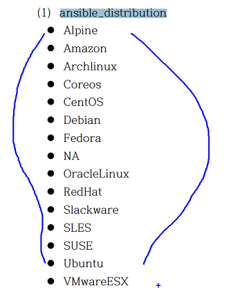
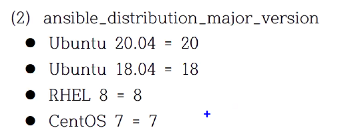
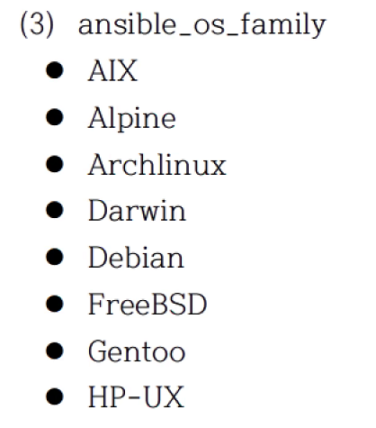

# 작업 제어 - 기본
 
## 6.1 반복문
ansible 2.4 까지는 with_* 사용하였었는데
ansible 2.5 부터 loop를 추가함

loop 키워드를 사용하면 기존의 with_* 키워드로 했던게 일부 안되는 경우가 있음.

변수의 값을 받는 변수명은 항상 item 이다!!!
반복문에서 제공되는 목록을 참조하는 변수는 항상 item 이다

```yaml
- hosts: 192.168.200.101
  tasks:
    - debug:
        msg: "{{ item }}"
      loop:
        - one
        - two
        - three
```
```shell
$ ansible-playbook loop.yaml 
PLAY [192.168.200.101] *********************************************************************************

TASK [Gathering Facts] *********************************************************************************
ok: [192.168.200.101]

TASK [debug] *******************************************************************************************
ok: [192.168.200.101] => (item=one) => {
    "msg": "one"
}
ok: [192.168.200.101] => (item=two) => {
    "msg": "two"
}
ok: [192.168.200.101] => (item=three) => {
    "msg": "three"
}

PLAY RECAP *********************************************************************************************
192.168.200.101            : ok=2    changed=0    unreachable=0    failed=0    skipped=0    rescued=0    ignored=0  
```

```yaml
- hosts: 192.168.200.101
  vars:
    loop_list:
      - one
      - two
      - three
  tasks:
    - debug:
        msg: "{{ item }}"
      loop:
        "{{ loop_list }}"
```
### 1) 단순반복

패키지를 설치하는 곳에 반복문을 실행하면 오히려 오래걸림, 걍 컴마로 나열하셈!

명령이 한번만 실행됨: apt install apache2,php
명령이 2번 실행됨: apt install apache2; apt install php # 반복문 사용하면 요로케.. 성능에 마이너스~

모듈에 따라서 리스트로 받을수 있는 모듈이 있고 안되는 모듈이 있음

### 2) 사전 목록 반복
```yaml
- name: add several users
  user:
    name: "{{ item.name }}"
    state: present
    groups: "{{ item.groups }}"
  loop:
    - { name: 'testuser1', groups: 'wheel' }
    - { name: 'testuser2', groups: 'root' }
```
item.<dict_key> 형식으로 참조
user 모듈이 2번 실행됨

### 3) 중첩 목록 반복
데카르트의 곱... product
```yaml

```

총 6번이 실행됨

alice 의 clientdb
alice 의 employeedb
alice 의 providerdb
bob 의 clientdb
bob 의 employeedb
bob 의 providerdb

### 4) 인벤토리 반복
```yaml
- debug:
    msg: "{{ }}"

```
인벤토리 호스트 쿼리하여 사용 가능


## 6.2 조건문
변수의 값이 test_name 이면 실행을 하거라
```yaml
- debug:
    msg: hello world
  when: variable is test_name
  ```


### 1) 테스트
참인지 거짓인지 평가
엔시블 플레이북 실행 후 마지막에 recap 부분에 skip 이뜨면 넘어간 task임

#### (2) 버전 비교 테스트
```yaml
when: ansible_facts['distribution_version'] is version('12.04', '>=')
```

#### (3) 경로 테스트

- dir: is directory
- file: is file
- symlink: is link
- exist: is exist
- same compare: is samefile(path)
- mount: is mount

#### (4) 이전 작업의 결과 테스트

shell 요녀석은 모듈이 없을 불가피하게 사용
ignore_errors: True
이전 작업이 실패하든 말든~ 다음으로 넘어간다

result is successed 변경 사항 없지만 성공쓰

- failed: result is failed
- changes: is changes
- succeeded: result is succeeded
- skipped: result is skipped


### 2) 조건문
너무나도 많이 사용한다.

#### (1) 기본 조건문
#### (2) 팩트 변수 기반의 조건문
멀티 os 기반의 모듈을 실행해야할 때 정말 많이 사용하는 조건문
`when: ansible_facts['os_family']` == "Debian"
distribution 도 체크

- OS가 어떤 계열 인지 확인 (Debian/Redhat)
  `ansible_facts['os_family'] == 'Debian'`

- OS 배포판 확인
  `ansible_facts['distribution'] == 'CentOS'`

- OS 배포판 버젼 확인
  `ansible_facts['distribution_major_version'] == '7'`

여러 조건 목록으로 표현하면 and 연산이 적용 or 연산은 없음


#### (3) 등록 변수 기반의 조건문

## 3) 조건문에 자주 사용되는 팩트와 변수값






* 실습
```yaml
---
- name: Simple Web Deploy
  hosts: 192.168.200.101
  vars:
    contents_file: index.php
    apache_port: "8080"

  tasks:
  - name: Install Pacakge for Ubuntu
    apt:
      name: apache2, libapache2-mod-php
      update_cache: true
      state: present
    when: ansible_distribution == "Ubuntu"
  
  - name: Install Package for CentOS
    yum:
      name: httpd, mod-php
      state: present
    when: ansible_distribution == "CentOS"

  - name: Copy PHP Contents
    copy:
      src: '{{ contents_file }}'
      dest: '/var/www/html/{{ contents_file }}'
      backup: true

  - name: Configure Apache Port
    template:
      src: ports.conf.j2
      dest: '/etc/apache2/ports.conf'

  - name: Start Service
    service:
      name: apache2
      state: restarted
      enabled: true

  - name: Checking
    uri:
      url: "http://192.168.200.101:{{ apache_port }}/{{ contents_file }}"
```

## 6.3 핸들러

## 6.4 위임


## 6.5 블록